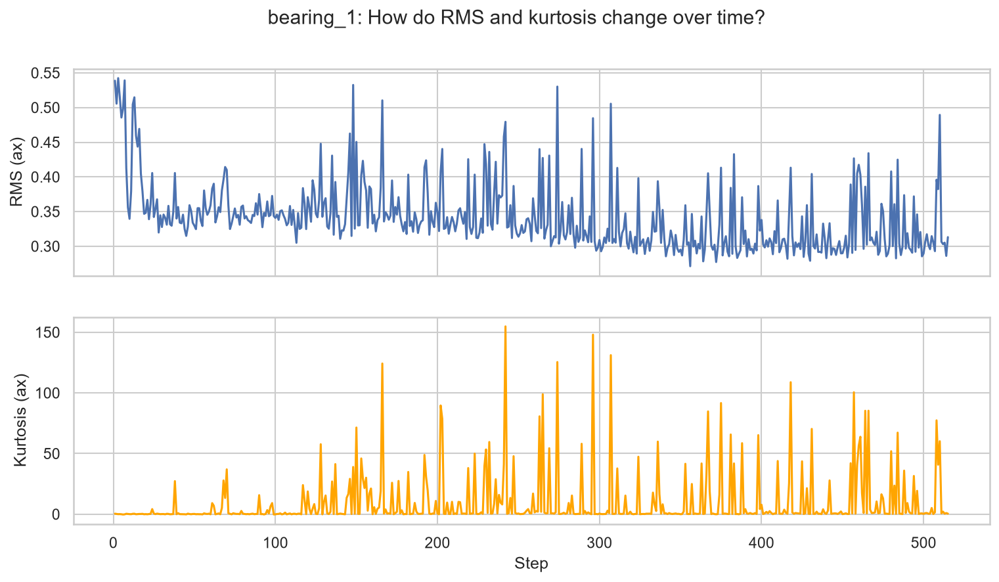
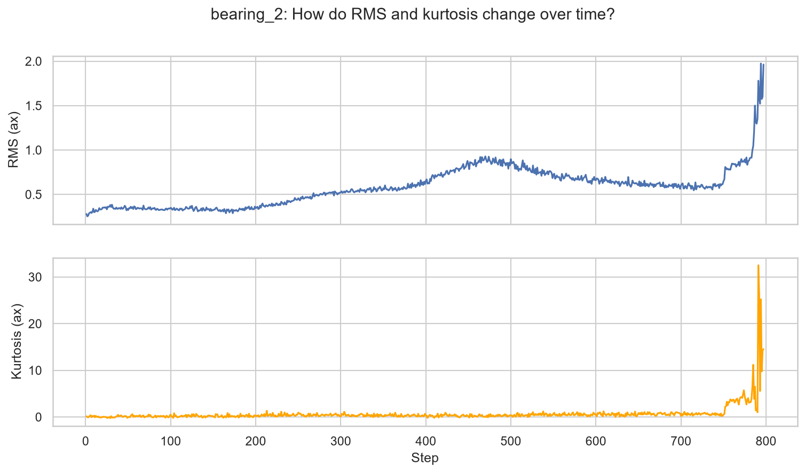
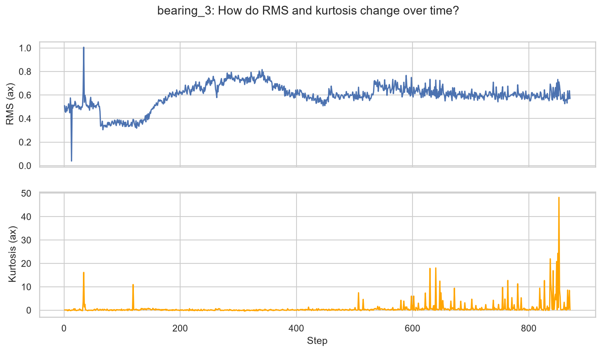
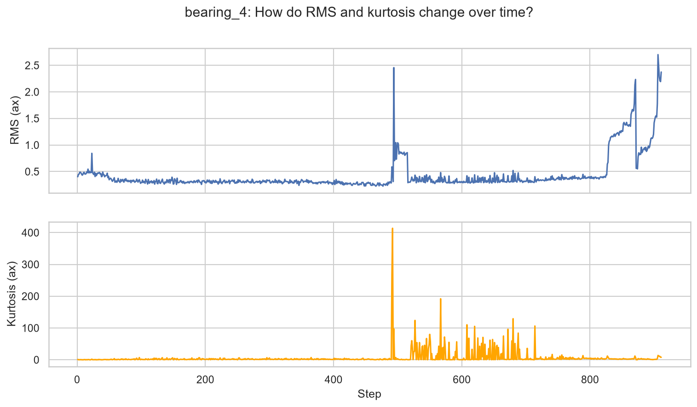
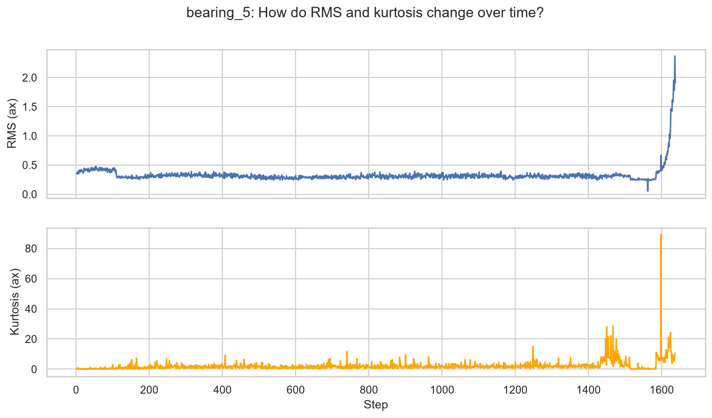
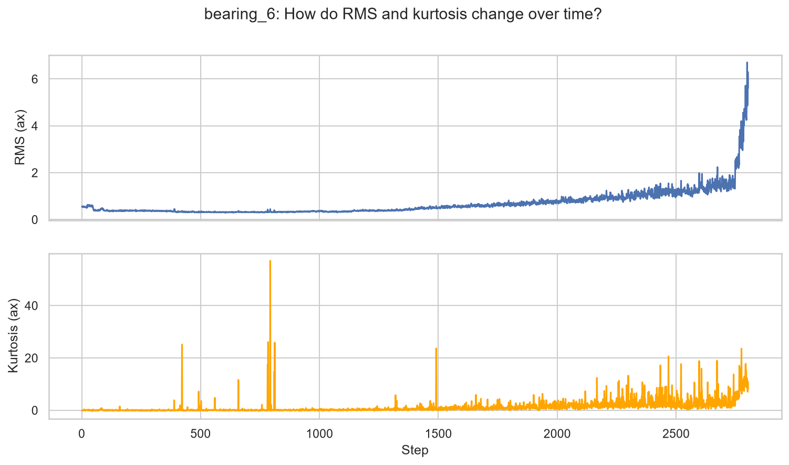

# FEMTO Bearing — RMS & Kurtosis Findings

## What & why

For each bearing, we computed **RMS** (vibration energy) and **kurtosis** (signal "spikiness", an early-warning indicator) per time block, then plotted both over time. Goal: see what a healthy → failing bearing looks like before building any labeling logic.

## Findings per bearing

**bearing_1** (~510 steps)

No clean pattern — RMS stays noisy throughout, kurtosis spikes are scattered, not concentrated near the end.

**bearing_2** (~800 steps)

Textbook pattern: flat RMS until step ~200, gradual rise, sharp final rise after step ~750. Kurtosis only spikes at the very end.

**bearing_3** (~870 steps)

Noisy like bearing_1 — reaches a plateau but no dramatic final rise by the last recorded step.

**bearing_4** (~900 steps)

Flat until ~450, then an isolated one-off spike (~490) that recovers, then real degradation starts later (~800+). The mid-life spike looks like a separate transient event, not the true failure onset.

**bearing_5** (~1650 steps)

Cleanest case: very long flat period, sharp unambiguous rise only in the last ~150 steps.

**bearing_6** (~2800 steps, longest life)

Long flat period, slow rise from step ~2000, steep final rise. Kurtosis spikes increase before RMS clearly rises — possibly an earlier warning signal here.

## Overall takeaways

1. Lifetimes vary widely (510-2800 steps).
2. 4/6 bearings (2, 4, 5, 6) show the expected flat-then-rise pattern; 2/6 (1, 3) stay noisy with no clean ending — consistent with literature noting PRONOSTIA's overload blends failure modes and adds noise.
3. Kurtosis spikes are sharp and isolated; in clean bearings they cluster at end-of-life, but in bearing_6 they rise earlier than RMS.
4. bearing_4's mid-life spike is a good test case for distinguishing transient anomalies from true failure onset.

**Implication**: a single fixed threshold won't work for every bearing — labeling logic needs to be validated per bearing, not assumed to generalize.